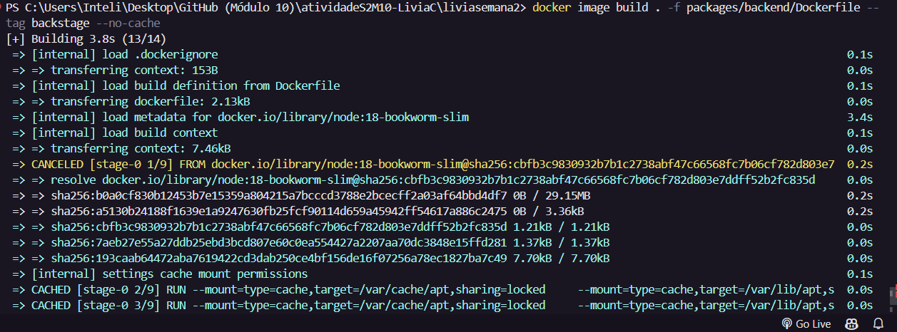

# Programação - Semana 2 - Módulo 10
## Relatório: Deploying backstage on docker

### Aluna: Livia Coutinho

 

# Resumo da tecnologia:
O Backstage é uma plataforma de desenvolvimento de software de código aberto criada pela Spotify.  
Essa plataforna oferece uma maneira unificada de visualizar, gerenciar e colaborar em todos os aspectos do ciclo de vida do desenvolvimento de software.  
Com o Backstage, as equipes podem criar seus próprios aplicativos personalizados para fornecer uma visão holística de seus projetos, incluindo informações sobre serviços, documentação, integrações, pipelines de CI/CD etc.

# Conceitos aprendidos:

**1. Instalação de um servidor independente:**
- Como configurar um ambiente de desenvolvimento local do Backstage usando o comando npx @backstage/create-app@latest.
- Os pré-requisitos incluem sistemas operacionais baseados em Linux, comandos de terminal e a instalação de ferramentas como Node.js, Yarn, Docker e Git, que eu já tinha.
- O Backstage é instalado em um diretório local com uma estrutura de pasta específica, que vai conter arquivos de configuração principais, informações de catálogo e diretórios tanto para front quanto para back.

**2. Execução do app Backstage:**

- Considerando feita a instalação, o aplicativo Backstage pode ser iniciado (comando yarn dev).
- O frontend e o backend são executados como processos separados, e quando o frontend for compilado com sucesso, o navegador vai automaticamente abrir a interface do Backstage em http://localhost:3000.

**3. Construção de imagem Docker:**
- COnstrução da imagem Docker para o Backstage, que vai poder contar com dois métodos de construção: uma abordagem de build no host e uma build de vários estágios.
- Ambos os métodos vão envolver a instalação de dependências, a compilação do código e a configuração do ambiente para servir o aplicativo Backstage.
- A construção da imagem Docker pode ser feita em um único contêiner ou em vários estágios (essa escolha vai variar de acordo as necessidades do usuário).

## Próximos passos:
O tutorial fornece informações sobre os próximos passos, dependendo do papel do usuário, seja administrador ou desenvolvedor. Para administradores, os próximos passos incluem explorar a seção de administração, enquanto para os desenvolvedores, é sugerido explorar a seção de desenvolvimento.

# Passo a passo

### Instalando o backstage:

- 1.  Rodar o comando npx @backstage/create-app@latest --skip-install

- 2. Atribuir um nome para a aplicação

- 3. Navegar até a pasta e rodar o yarn install

- 4. Corrigir o yarn (npm install --global yarn)

- 5. yarn install novamente

## Preparação do build do backstage:

- 1. **Rodar o comando yarn install --frozen-lockfile**

- 2. **Preparação dos types com o comando yarn tsc**

- 3. **Rodar o comando yarn build:backend**

O erro está ocorrendo porque o ambiente em que o comando está sendo executado tem uma versão do Node.js que não é compatível com as especificações do projeto. 
O projeto espera uma versão do Node.js que seja 18 ou 20, mas a versão atual do Node.js instalada no ambiente é 21.7.1.

- 4. **Para gerenciar o erro acima, precisarei usar o NVM**

-- Rodar novamente o yarn install

-- Erros de conexão. Trocar a rede wi-fi.

-- Rede wi-fi trocada. Yarn install novamente.

-- Rodar novamente o yarn install --frozen-lockfile
-- Rodar novamente o yarn tsc

Para resolver o erro acima:
-- npm install -g typescript
-- yarn global add typescript

-- Rodar novamente o yarn tsc
-- Rodar o yarn build:backend

## Ajustes do dockerfile do backstage
- Abrir o liviasemana2\packages\backend\Dockerfile
- Substituir esse código pelo o que o Saadi enviou no grupo

- docker image build . -f packages/backend/Dockerfile --tag backstage --no-cache

- docker run -it -p 7007:7007 backstage
#### - http://localhost:7007/